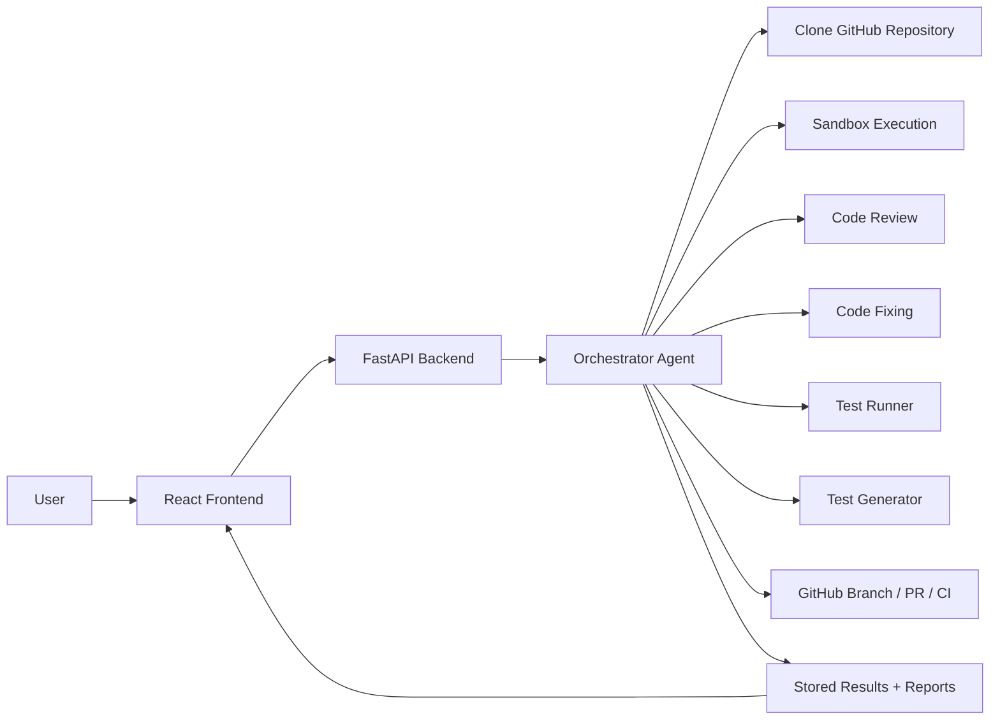

# DeployDoctor

**DeployDoctor** is an AI-powered DevOps assistant that analyzes GitHub repositories, detects code issues, proposes or applies fixes, generates tests, and helps teams push remediation changes back to GitHub through branches and pull requests.

It combines a modern React frontend with a FastAPI backend that orchestrates a multi-agent analysis pipeline.

---

## Problem

Engineering teams often lose time on repetitive and fragmented maintenance work:

- bugs are discovered late in the development cycle
- repositories require manual code review across many files
- failing tests and environment issues slow down delivery
- fix suggestions are disconnected from execution and validation
- creating branches, pull requests, and CI follow-up takes extra effort

Traditional tooling can identify isolated issues, but not coordinate the full workflow from **analysis → fix → validation → GitHub delivery**.

---

## Solution

DeployDoctor provides a unified workflow for repository remediation.

A user submits a GitHub repository URL from the web app, and the backend:

1. clones the repository into a temporary workspace
2. runs sandbox execution to surface runtime and setup issues
3. performs AI-assisted line-by-line code review
4. attempts iterative code fixes
5. runs tests and captures failures
6. optionally generates new tests
7. optionally pushes fixes to GitHub, creates a PR, and tracks CI status
8. stores results and exposes downloadable reports

---

## Key Features

### Repository analysis
- Analyze public GitHub repositories from a single form
- Track progress for long-running analysis jobs
- Persist analysis results for recovery after restarts

### Multi-agent backend workflow
- **Orchestrator Agent** to coordinate the pipeline
- **Code Review Agent** for deep file-by-file inspection
- **Sandbox Executor Agent** for runtime and environment validation
- **Code Fixer Agent** for iterative repair attempts
- **Test Runner Agent** for framework-aware test execution
- **Test Generator Agent** for AI-generated tests

### Authentication and security
- Email/password authentication
- JWT-based access flow
- refresh-token cookie support
- two-factor authentication setup and verification
- account update and password change endpoints

### GitHub integration
- optional push of fixes to a new branch
- optional pull request creation
- CI status polling for created PRs
- optional merge action after successful CI

### Rich frontend experience
- authentication flows with protected routes
- repository submission form with pipeline options
- live status polling
- detailed analysis result view
- PR, CI, fixes, tests, and summary reporting UI
- settings pages for account, security, appearance, and 2FA

### Reporting
- JSON report export
- PDF report export
- cached analysis results on disk

---

## How It Works



---

## Architecture Overview

### Frontend
The frontend is a Vite + React + TypeScript application that provides:
- sign in, sign up, and 2FA flows
- protected application layout
- repository analysis form
- analysis status and results dashboard
- account and settings screens

### Backend
The backend is a FastAPI service that provides:
- REST APIs for auth, health, and analysis
- async database access with SQLAlchemy
- agent orchestration for repository analysis
- report generation and result persistence
- GitHub automation hooks for PR/CI workflows

---

## Tech Stack

### Frontend
- React 19
- TypeScript
- Vite
- React Router
- TanStack Query
- Zustand
- React Hook Form + Zod
- Axios
- Tailwind CSS 4
- Radix UI / shadcn-style UI components
- Sonner notifications

### Backend
- FastAPI
- Python
- SQLAlchemy Async
- Alembic
- PostgreSQL
- JWT auth
- pyotp for 2FA
- LangChain + Groq
- GitPython
- reportlab

---

## Project Structure

```text
DevOpsAgent/
├── backend-updated/
│   ├── agents/                # AI agents for review, fixing, testing, orchestration
│   ├── config/                # app settings and database configuration
│   ├── migrations/            # Alembic migrations
│   ├── models/                # SQLAlchemy models
│   ├── reports/               # generated reports
│   ├── results_cache/         # persisted analysis results
│   ├── routes/                # FastAPI routers
│   ├── schemas/               # request/response schemas
│   ├── services/              # analysis, auth, GitHub, and business logic
│   ├── temp_repos/            # cloned repositories during execution
│   ├── analysis_schemas.py    # analysis domain models
│   ├── main.py                # FastAPI application entrypoint
│   ├── requirements.txt       # Python dependencies
│   └── alembic.ini            # migration configuration
├── frontend/
│   ├── public/                # static assets
│   ├── src/
│   │   ├── api/               # API clients for auth, analysis, dashboard
│   │   ├── assets/            # logos and images
│   │   ├── components/        # reusable UI and feature components
│   │   ├── config/            # frontend config helpers
│   │   ├── context/           # React contexts
│   │   ├── hooks/             # custom hooks
│   │   ├── lib/               # shared frontend utilities/types
│   │   ├── pages/             # route-level pages
│   │   ├── stores/            # Zustand state stores
│   │   ├── utils/             # frontend helper utilities
│   │   ├── App.tsx            # route definitions
│   │   └── main.tsx           # app bootstrap
│   ├── package.json           # Node scripts and dependencies
│   └── vite.config.ts         # Vite configuration
└── README.md
```

---

## Core User Flows

### 1. Authentication
Users can register, log in, verify 2FA, refresh sessions, and manage account settings.

### 2. Start analysis
Users provide:
- repository URL
- team name
- team leader name
- optional GitHub token
- pipeline options such as test generation, push, PR creation, and auto-merge

### 3. Review progress
The frontend polls the backend for analysis status and displays execution progress.

### 4. Inspect results
Users can inspect:
- detected failures
- applied fixes
- test results
- generated tests
- repository metadata
- pull request and CI status

### 5. Export reports
Users can download machine-readable JSON reports or human-readable PDF reports.

---

## Backend API Overview

### Health
- `GET /`
- `GET /api/health`

### Authentication
- `POST /api/auth/register`
- `POST /api/auth/login`
- `POST /api/auth/verify-2fa`
- `POST /api/auth/refresh`
- `POST /api/auth/logout`
- `GET /api/auth/me`
- `POST /api/auth/setup-2fa`
- `POST /api/auth/enable-2fa`
- `POST /api/auth/disable-2fa`
- `PUT /api/auth/update-account`
- `POST /api/auth/change-password`

### Analysis
- `POST /api/analyze`
- `GET /api/analyze/{analysis_id}/status`
- `GET /api/analyze/{analysis_id}/result`
- `DELETE /api/analyze/{analysis_id}`
- `GET /api/analyze/{analysis_id}/ci-status`
- `POST /api/analyze/{analysis_id}/merge`
- `GET /api/analyze/{analysis_id}/report/json`
- `GET /api/analyze/{analysis_id}/report/pdf`

---

## Local Development Setup

## Prerequisites

- Node.js 20+
- npm
- Python 3.11+
- PostgreSQL
- Git
- optional: Groq API key for LLM-powered analysis

### 1. Clone the repository
```bash
git clone <your-repo-url>
cd DevOpsAgent
```

### 2. Backend setup
```bash
cd backend-updated
python -m venv .venv
```

Activate the environment:

**Windows (PowerShell)**
```powershell
.\.venv\Scripts\Activate.ps1
```

**macOS / Linux**
```bash
source .venv/bin/activate
```

Install dependencies:
```bash
pip install -r requirements.txt
```

Create `.env` from `.env.example` and configure your values.

Run database migrations:
```bash
alembic upgrade head
```

Start the backend:
```bash
uvicorn main:app --reload
```

Backend runs by default on `http://localhost:8000`.

### 3. Frontend setup
```bash
cd ../frontend
npm install
```

Create or update `.env`:
```dotenv
VITE_API_BASE_URL=http://localhost:8000
VITE_APP_NAME=DeployDoctor
VITE_APP_VERSION=1.0.0
VITE_ENVIRONMENT=development
```

Start the frontend:
```bash
npm run dev
```

Frontend runs by default on `http://localhost:5173`.

---

## Environment Variables

### Backend
Example values are already provided in [backend-updated/.env.example](backend-updated/.env.example).

Common variables:

- `GROQ_API_KEY`
- `DATABASE_URL`
- `JWT_SECRET`
- `ACCESS_TOKEN_EXPIRE_MINUTES`
- `REFRESH_TOKEN_EXPIRE_DAYS`
- `COOKIE_SECURE`
- `COOKIE_SAMESITE`
- `GITHUB_TOKEN`
- `GIT_USER_NAME`
- `GIT_USER_EMAIL`
- `CI_TIMEOUT`
- `AUTO_MERGE_ON_SUCCESS`

### Frontend
Common variables:

- `VITE_API_BASE_URL`
- `VITE_APP_NAME`
- `VITE_APP_VERSION`
- `VITE_ENVIRONMENT`

---

## Notable Implementation Details

- The backend uses async SQLAlchemy and FastAPI dependency injection.
- Analysis results are cached in `backend-updated/results_cache/` for recovery.
- Refresh tokens are stored in HTTP-only cookies.
- The frontend uses Axios interceptors for token refresh and auth recovery.
- Protected routes are enforced in the React app.
- The analysis UI supports optional GitHub push, PR creation, CI tracking, and merge actions.

---

## Current Scope

This project already supports a broad analysis workflow, with a few practical boundaries worth noting:

- line-by-line AI review supports multiple source languages
- automated test execution supports common Python and JavaScript/TypeScript workflows
- AI test generation is currently centered on Python files
- GitHub automation depends on repository access and valid credentials

---

## Why This Project Stands Out

DeployDoctor is more than a static scanner. It is an end-to-end remediation workflow that connects:

- issue discovery
- AI-assisted reasoning
- fix generation
- validation through tests
- GitHub delivery and CI visibility

That makes it especially useful for hackathons, internal DevOps tooling, engineering productivity experiments, and intelligent repository maintenance platforms.

---

## Future Enhancements

Potential next steps:

- role-based access control
- more language-specific fix strategies
- stronger vulnerability and dependency analysis
- richer dashboards and analytics
- containerized deployment setup
- background job queue for large repository analysis
- webhook-based CI updates instead of polling

---

## License

Add your preferred license here before publishing publicly.

---

## Acknowledgements

Built with FastAPI, React, TypeScript, LangChain, Groq, and the open-source ecosystem.
